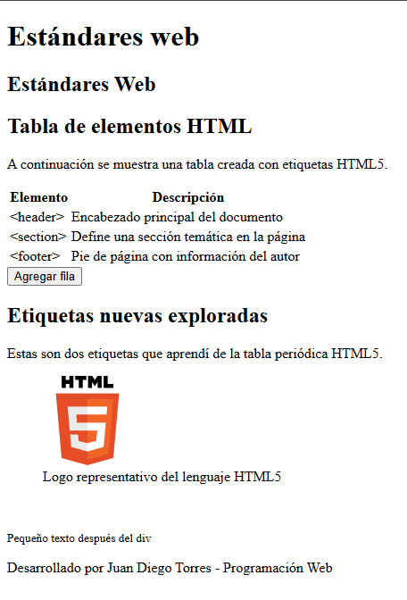
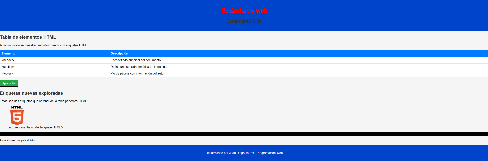

# Programación y Plataformas Web (PPW)

---

# Práctica 1 – Explorando los Estándares Web con HTML, CSS y JavaScript

**Asignatura:** Programación y Plataformas Web
**Unidad:** 1.2 – Estándares Web
**Estudiante:** Juan Diego Torres
**Repositorio:** [https://github.com/diegotorres006/icc-ppw-u1-miPrimeraPagina](https://github.com/diegotorres006/icc-ppw-u1-miPrimeraPagina)
**Página desplegada (GitHub Pages):** (añade tu URL de GitHub Pages si la tienes)

---

## 🧱 Estructura HTML utilizada

| Componente               | Descripción                              | Implementación                                                                                  |
| ------------------------ | ---------------------------------------- | ----------------------------------------------------------------------------------------------- |
| `<!DOCTYPE html>`        | Declaración del documento HTML5          | Línea 1                                                                                         |
| `<html lang="es">`       | Idioma del documento                     | Español                                                                                         |
| `<head>`                 | Metadatos, enlaces a CSS y JS            | `<meta>`, `<link rel="stylesheet" href="style.css">`, `<script defer src="script.js"></script>` |
| `<header>`               | Encabezado principal                     | Contiene `<h1 id="titulo">` y `<h2>`                                                            |
| `<main>` / `<section>`   | Agrupa el contenido principal            | Dos secciones: tabla de elementos y etiquetas exploradas                                        |
| `<table>`                | Muestra los elementos estudiados         | Tabla con id `tablaElementos`                                                                   |
| `<figure>`               | Contenedor para imagen con pie de foto   | Logo HTML5 dentro de `<figure>` con `<figcaption>`                                              |
| `<div id="progresoDiv">` | Barra de progreso implementada con `div` | Usado en lugar de `<progress>`                                                                  |
| `<footer>`               | Pie de página                            | Texto con autor y asignatura                                                                    |

---

## 🧩 Nuevas etiquetas exploradas

| Etiqueta                 | Descripción                            | Implementación                                   |
| ------------------------ | -------------------------------------- | ------------------------------------------------ |
| `<figure>`               | Contenedor para imagen con pie de foto | `figure` con `img` y `figcaption`                |
| `<div id="progresoDiv">` | Barra de progreso creada con `div`     | Barra con estilo en CSS en lugar de `<progress>` |

**Fragmento del HTML (tomado de tu `index.html`):**

```html
<figure>
  
  <figcaption>Logo representativo del lenguaje HTML5</figcaption>
</figure>

<!-- Barra de progreso hecha con div -->
<div id="progresoDiv" role="progressbar" aria-valuenow="70" aria-valuemin="0" aria-valuemax="100" style="height:18px;"></div>
```

> **Nota:** Recomendado: mover la imagen localmente a `assets/images/html5-logo.svg` para que GitHub Pages la sirva sin depender de enlaces externos.

---

# Práctica 2 – Adición de CSS y JavaScript (estructura del profesor, con tu código)

---

### 1. Archivos agregados

| Archivo      | Descripción                                                               | Ubicación                 |
| ------------ | ------------------------------------------------------------------------- | ------------------------- |
| `index.html` | HTML principal con estructura y contenido mostrado arriba                 | Carpeta raíz del proyecto |
| `style.css`  | Estilos visuales (tipografía, colores, tabla, botones, barra de progreso) | Carpeta raíz del proyecto |
| `script.js`  | Comportamiento: agregar filas a la tabla y eventos sobre el título        | Carpeta raíz del proyecto |

Estructura final del proyecto (ajusta si tu estructura es distinta):

```
icc-ppw-u1-mi_pagina_web/
│
├── index.html
├── style.css
├── script.js
└── assets/
    └── images/
        └── html5-logo.svg
```

---

### 2. Implementación en `index.html` (enlaces a CSS y JS)

**En el `<head>` (para el CSS):**

```html
<link rel="stylesheet" href="style.css">
```

**Antes de cerrar el `<body>` (para el JavaScript):**

```html
<script defer src="script.js"></script>
</body>
```

*Tu `index.html` ya incluye estas líneas.*

---

### 3. Estilos aplicados con CSS (tabla como en la guía del profesor)

| Elemento                    | Estilo implementado                                                         | Descripción                               |
| --------------------------- | --------------------------------------------------------------------------- | ----------------------------------------- |
| `body`                      | `font-family: Arial, background-color: #f5f5f5; margin:0;`                  | Tipografía y fondo base                   |
| `header`                    | `background-color: #0044cc; color: white; text-align:center; padding:1rem;` | Encabezado con color primario             |
| `table` (`#tablaElementos`) | `width:100%; border-collapse:collapse; background:#fff;`                    | Tabla responsiva con celdas con borde     |
| `th, td`                    | `border:1px solid #ddd; padding:8px; text-align:left;`                      | Estilos de celdas                         |
| `button`                    | `background-color:#28a745; color:white; padding:8px 12px;`                  | Botón con hover declarado                 |
| `#progresoDiv`              | `height:18px; background-color:black; width:70%;` (ejemplo)                 | Barra de progreso (usa `role` y `aria-*`) |

**Fragmentos de CSS (tal cual en `style.css`, con recomendación de ajustar `div` selector):**

```css
body {
  font-family: Arial, sans-serif;
  background-color: #f5f5f5;
  margin: 0;
  padding: 0;
}

header {
  background-color: #0044cc;
  color: white;
  text-align: center;
  padding: 1rem;
}

/* ... (resto igual) ... */

/* Recomendación: reemplaza la regla global `div` por `#progresoDiv` */
#progresoDiv {
  background-color: black;
}
```

---

### 4. Interactividad agregada con JavaScript (ejemplos y explicación)

**Código en `script.js` (tal cual):**

```javascript
document.getElementById("agregarFila").addEventListener("click", function() {
    const tabla = document.getElementById("tablaElementos");
    const nuevaFila = tabla.insertRow();
    const celda1 = nuevaFila.insertCell(0);
    const celda2 = nuevaFila.insertCell(1);
    celda1.textContent = "hola";
    celda2.textContent = "hola";
});

const titulo = document.getElementById("titulo");

titulo.addEventListener("mouseover", function() {
    titulo.style.color = "red";
});

titulo.addEventListener("mouseout", function() {
    titulo.style.color = "white";
});
```

**Explicación:**

* El botón con id `agregarFila` inserta una nueva fila al final de la tabla `#tablaElementos` con dos celdas que contienen el texto "hola".
* El título `#titulo` cambia a color rojo al pasar el ratón y vuelve a blanco al salir.

---

## Capturas de pantalla del proyecto final

Incluye dos imágenes en `assets/images/` y referencia relativo en el README:

```markdown


```

